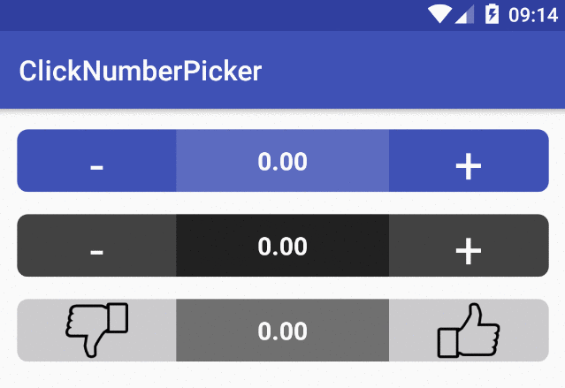

#ClickNumberPicker
Custom view to pick up a value from a given range using click button or swiping.

###Version: 0.1.2

[](https://www.apache.org/licenses/LICENSE-2.0)

Notice that ClickNumberPicker is a project under development. So far it contains very basic stuff and has some annoying restrictions but after few months of not doing anything with it, I decided to publish and hopefully this will be my motivation to finally improve it.
####Welcome to fork and pull request.

###Screenshot


#Integration
```groovy
dependencies {
    compile 'com.github.polok:clicknumberpicker:0.1.2'
}
```

###### Using Maven:

```xml
<dependency>
    <groupId>com.github.polok</groupId>
    <artifactId>clicknumberpicker</artifactId>
    <version>0.1.2</version>
</dependency>
```

#Usage

######Add a picker in your xml layout file
```xml
    <pl.polak.clicknumberpicker.ClickNumberPickerView
        android:layout_width="match_parent"
        android:layout_height="wrap_content"
        app:picker_corner_radius="10"
        app:pickers_background_color="#3F51B5"
        app:swipe_enabled="false"
        app:value_background_color="#5C6BC0"
        app:value_text_color="@android:color/white"/>
```

######Set a listener to be notified when value has changed:

```java
    picker.setClickNumberPickerListener(new ClickNumberPickerListener() {
        @Override
        public void onValueChange(float previousValue, float currentValue, PickerClickType pickerClickType) {
        }
    });
```

######Set picker's current value:

```java
    picker.setPickerValue(69f);
```

######Get picker's current value:

```java
    picker.getValue();
```

#Attributes

There are several attributes you can set:

| attr | description |
|:---|:---|
| value | current picker value. Default is 0 |
| min_value | Min picker value. Default is 0 |
| max_value | Max picker value. Default is 100 |
| step | Step value. Default is 1 |
| decimal_number | Round value after comma. Default is 2 |
| integer_priority | If current value is integer, show it without fraction part. Default is false |
| value_background_color | Value background color |
| pickers_background_color | Pickers background color |
| swipe_animation | Flag to allow swipe animation. Default is false |
| value_animation_up | Flag to turn on or off value change up animation. Default is false |
| value_animation_down | Flag to turn on or off value change down animation. Default is false |
| animation_value_down_duration | Duration of animation down |
| animation_value_up_duration | Duration of animation up |
| value_text_color | Value text color |
| value_text_size | Value text size |
| value_min_text_size | Value text min size for animation down |
| value_max_text_size | Value text max size for animation up |
| swipe_enabled | enable or disable swipe gestures, default is true |
| value_view_offset | Offset value for swiping animation |
| picker_corner_radius | Pickers corner radius |
| picker_border_stroke_width | Pickers border stroke width |
| picker_border_stroke_color | Pickers border stroke color |
| animation_offset_left_duration | Animation offset left duration |
| animation_offset_right_duration | Animation offset right duration |
| left_picker_layout | Left picker layout |
| right_picker_layout | Right picker layout |

License
--------

    Copyright 2016 Marcin Polak

    Licensed under the Apache License, Version 2.0 (the "License");
    you may not use this file except in compliance with the License.
    You may obtain a copy of the License at

       http://www.apache.org/licenses/LICENSE-2.0

    Unless required by applicable law or agreed to in writing, software
    distributed under the License is distributed on an "AS IS" BASIS,
    WITHOUT WARRANTIES OR CONDITIONS OF ANY KIND, either express or implied.
    See the License for the specific language governing permissions and
    limitations under the License.
